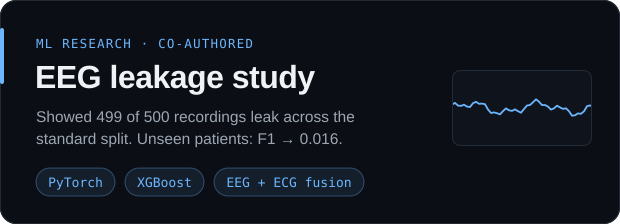
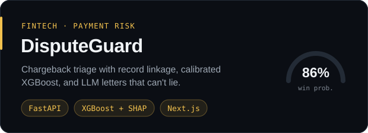

  
  
  
  

### Hey, I'm Adwait

CS undergrad who likes problems where "mostly works" isn't good enough: netcode where two machines must compute the exact same frame, tooling that blocks a tampered AI tool before the agent ever sees it, and ML results that still hold up when you test on a patient the model has never seen.

### Featured

 
 
 

### Also built

- **[FIFO Studio](https://fifo-site.pages.dev)**: the website for FIFO, an independent creative & technology studio. It's a cinematic, chaptered site, and its regional pricing comes from a single service catalogue, with each market priced in its own currency.
- **[DialOS](https://github.com/confuseddude/realtime_AI_twilio)**: real-time AI phone calls. Twilio media streams go to AssemblyAI for speaker-labelled transcripts and to OpenAI for replies, with a live transcript in the browser.
- **[Catalyst](https://github.com/confuseddude/market_research_bot)**: scans every BSE filing after market close through a 4-gate quantitative filter and an LLM analyst, then sends signals to Telegram.

### Stack

  
   
  
   
  

